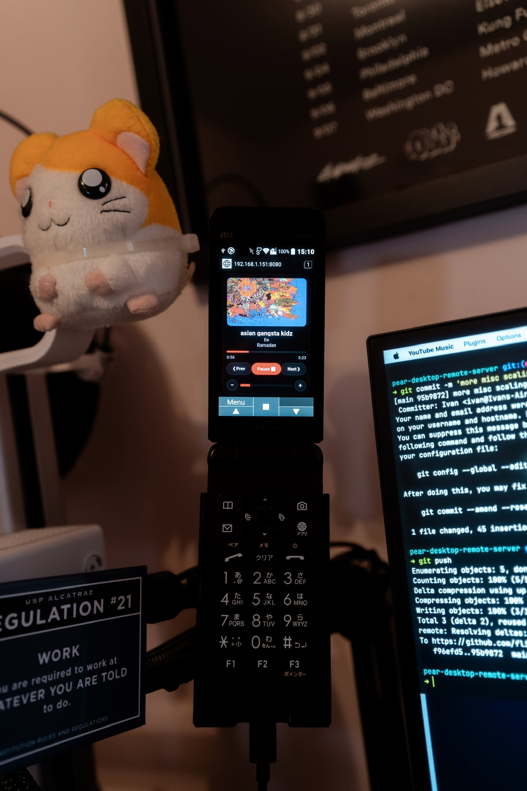

# pear-desktop-remote-server
A basic webserver for a Mac running pear-desktop, you can open it on another device (like an old phone) so you have a dashboard and wireless remote control for your music.

# Install
You need [Pear Desktop](https://github.com/pear-devs/pear-desktop) installed. You will also need to enable API server function. The script uses the default host/port (localhost:26538).
Just run `./install.sh`. It should start on boot.

# Customization
You can adjust granualrity of volume steps, etc in `config.py`.
